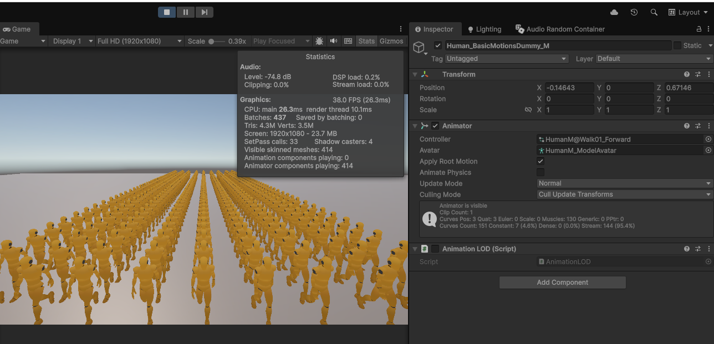
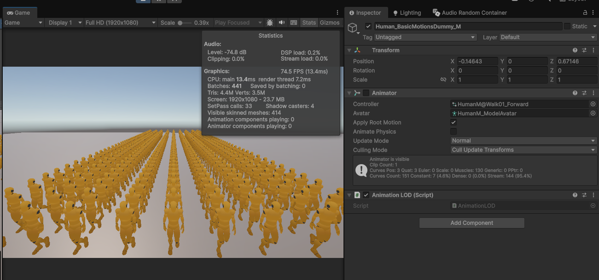

# Animation LOD for Unity

이 프로젝트는 다수의 애니메이터가 포함된 씬에서 성능을 최적화하기 위한 **애니메이션 LOD (Level of Detail)** 컨셉 증명을 위한 프로젝트 입니다. 카메라와의 거리에 따라 애니메이션의 업데이트 빈도(FPS)와 스킨 렌더링 품질을 동적으로 조절하여 CPU 및 GPU 부하를 줄입니다.

## 🚀 주요 기능

- **거리 기반 애니메이션 업데이트**: 카메라와 가까운 캐릭터는 매 프레임 업데이트하고, 멀리 있는 캐릭터는 설정된 주기(예: 5 FPS)에 맞춰 업데이트합니다.
- **스킨 메쉬 품질 최적화**: 멀리 있는 캐릭터의 `SkinnedMeshRenderer` 품질을 `Bone1`으로 낮추어 연산량을 절감합니다.
- **전역 관리 시스템**: `AnimationLODManager`를 통해 거리 임계값과 업데이트 주기를 한 번에 조절할 수 있습니다.
- **실시간 토글**: `T` 키를 눌러 기본 `Animator` 방식과 `AnimationLOD` 시스템 방식을 실시간으로 비교할 수 있습니다.

## 🖼️ 비교 (Comparison)

| 기존 Animator (LOD Off) | Animation LOD 적용 (LOD On) |
| :---: | :---: |
|  |  |
| 모든 캐릭터가 매 프레임 풀 품질로 갱신됨 | 거리에 따라 효율적으로 자원을 분배함 |

## 🛠️ 사용 방법

1. **AnimationLODManager 설정**:
   - CameraDistance값과 Animator업데이트 주기를 수정하기 위한 테스트 매니저입니다.(에디터로 한번에 모든 AnimationLOD 수정이 힘들기 때문에)
   - 빈 게임 오브젝트에 `AnimationLODManager` 스크립트를 추가합니다.
   - `Camera Distance`: 고품질 애니메이션을 유지할 최대 거리를 설정합니다.
   - `Timer`: LOD가 활성화된 거리에서 애니메이션이 업데이트될 주기(초)를 설정합니다. (예: 0.1 = 10 FPS, 0.2 = 5 FPS)

2. **캐릭터 설정**:
   - `Animator`가 있는 캐릭터 프리팹에 `AnimationLOD` 스크립트를 추가합니다.
   - 캐릭터의 `Animator` 컴포넌트 내 `Update Mode`를 **Manual**로 설정하거나, 스크립트에서 제어할 수 있도록 준비합니다.

3. **테스트**:
   - 런타임 중 `T` 키를 눌러 최적화 효과를 직접 확인해 보세요.

## 💻 코드 구조

- **`AnimationLODManager.cs`**: 모든 LOD 오브젝트를 관리하며, 전역 설정 및 비교 기능을 제공합니다.
- **`AnimationLOD.cs`**: 개별 오브젝트의 거리를 계산하여 `Animator.Update()` 호출 빈도와 `SkinnedMeshRenderer.quality`를 제어합니다.

